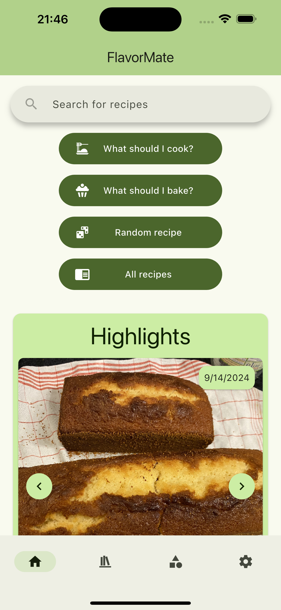
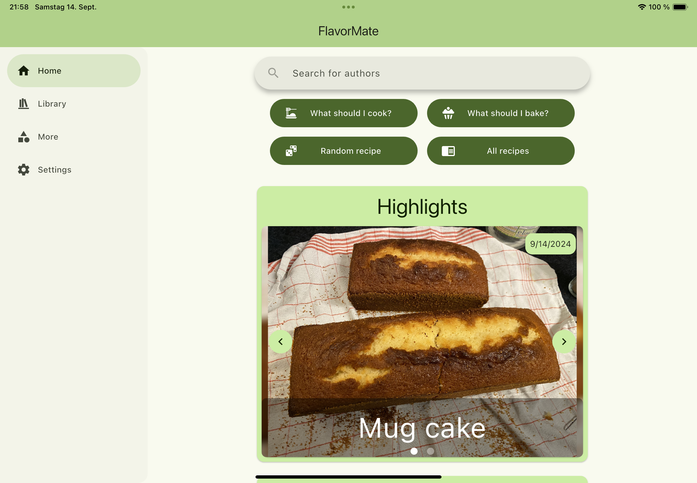
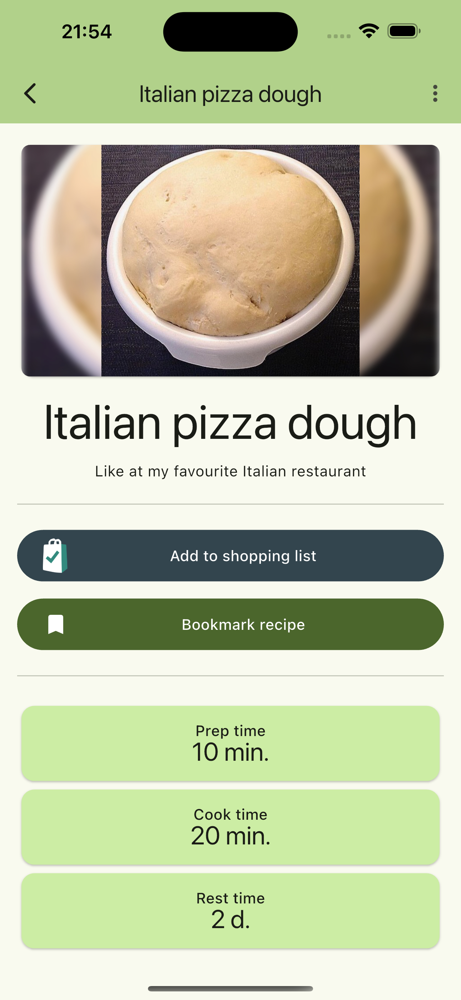
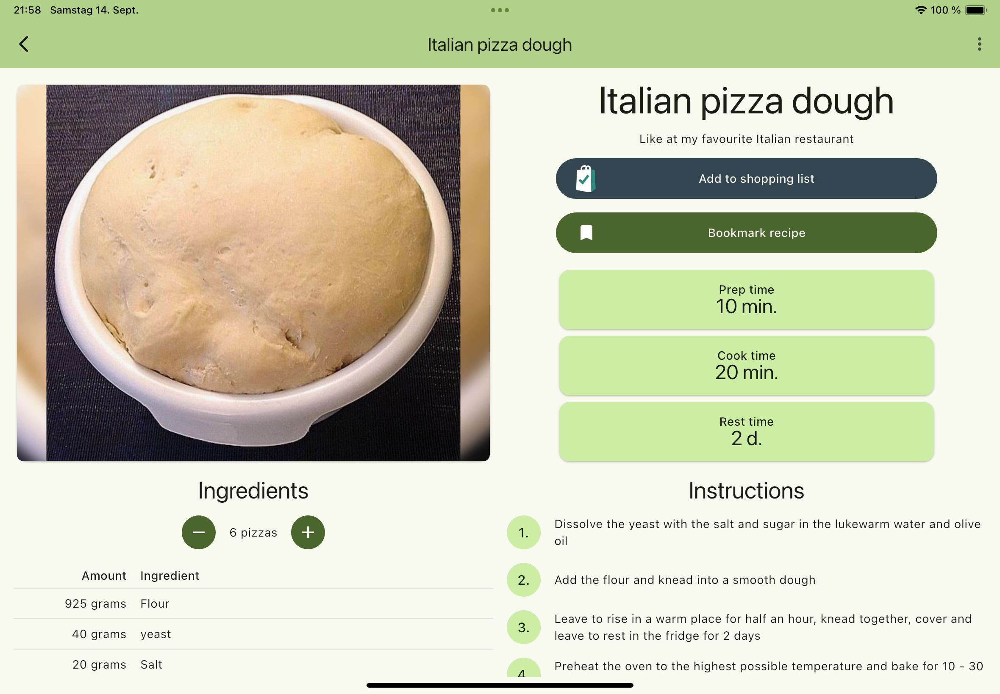
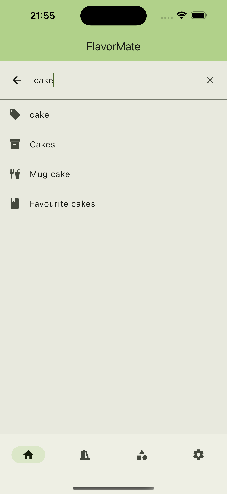
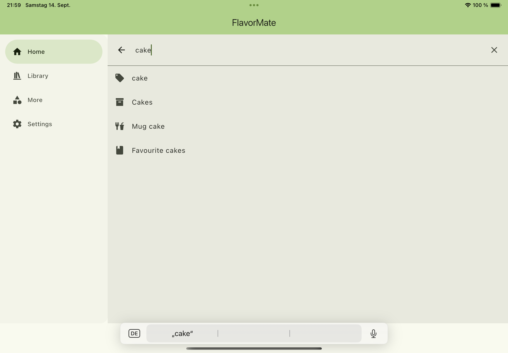

# FlavorMate

This is the Project for the FlavorMate frontend, which is written in Flutter.

## Features

See all the features with more screenshots on [flavormate.de](https://flavormate.de/features/)

 

 

## Getting Started

### Android

Want to join the closed beta? Send me your mail to be added to the test group. 
[Mail me](mailto:android-beta@flavormate.de?subject=Apply%20for%20android%20closed%20beta)

Download the apk from the releases tab.

### iOS

Download FlavorMate from the [App Store](https://apps.apple.com/de/app/flavormate/id6670196195) or join
the [public beta](https://testflight.apple.com/join/yp5BtJGx) via testflight.

### Web

Self host your web app with docker by simply creating a `docker-compose.yaml` (or download one from
the [examples](https://github.com/FlavorMate/flavormate-app/tree/main/examples)).

Alternatively download the web archive from the releases page and self host it manually.

#### Environment

*RECOMMENDED*

To permanently bind your frontend to your backend url add, the `BACKEND_URL` entry to your docker environment.

The user will then no longer be able to connect to other FlavorMate servers.
This improves the user experience and increases security.

| Key         | Required | Description                        | Example               | Default |
|-------------|----------|------------------------------------|-----------------------|---------|
| BACKEND_URL | No       | The url of your FlavorMate backend | `https://example.com` | `null`  |

## Build Project

1. Install and configure Flutter SDK
2. Run `flutter pub get` to fetch all dependencies
3. Run `dart run build_runner build` to generate necessary code
4. Run `flutter run` to run the app
