# FlavorMate

    

FlavorMate is your personal, self-hosted, open-source recipe management app, available on iOS, macOS, Android, and as a
web application. You can also build it from source for Linux and Windows. Organize your culinary creations by
categorizing and tagging them to suit your needs. Whether you’re crafting a recipe from scratch or importing one from
the web, FlavorMate makes it easy.

Stuck on what to cook or bake? Let FlavorMate inspire you with the Recipe of the Day or choose a dish at random. For
those following vegetarian or vegan lifestyles, simply set your preference in your profile, and you'll receive recipes
tailored just for you.

> [!TIP]
> This is the repository for the FlavorMate frontend, which is written in Flutter. 
> For the backend, please visit [this repository](https://github.com/FlavorMate/flavormate-server).

## Features

 Features and Screenshots 

### Dashboard

Get inspired by a selection of your recipes.

- Search for recipes, book, authors, tags or categories
- Let FlavorMate choose a random recipe for you to cook or bake
- See a highlighted recipe that is chosen once a day
- Get all the newest recipes

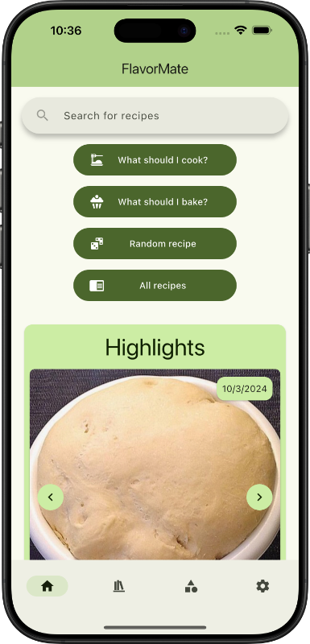
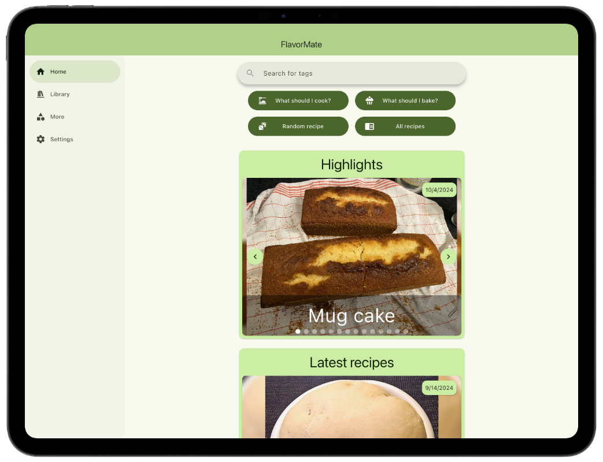

### Recipe view

Manage your recipes in a beautiful and easy way.

- Add all your recipes to your [bring!](https://getbring.com) shopping list[^1]
- See nutritional information

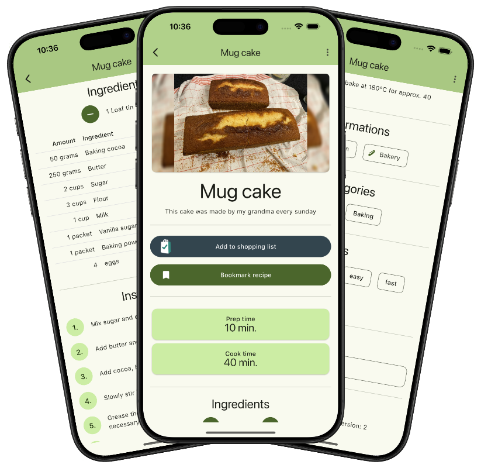

### Library

Create a book and save your favorite recipes

- You can create books and share them with other users
- You can subscribe to public books and get inspired

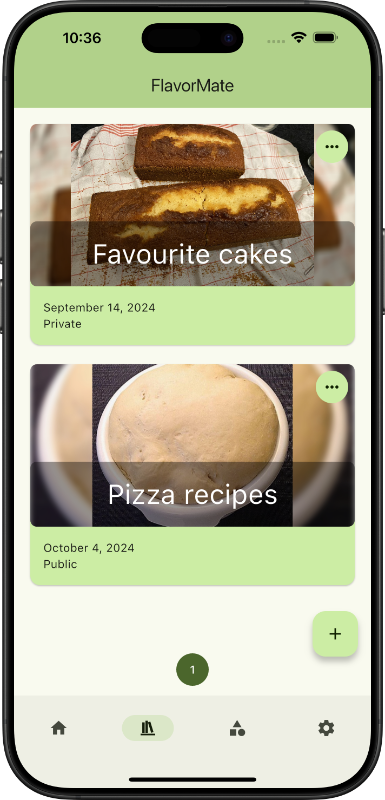
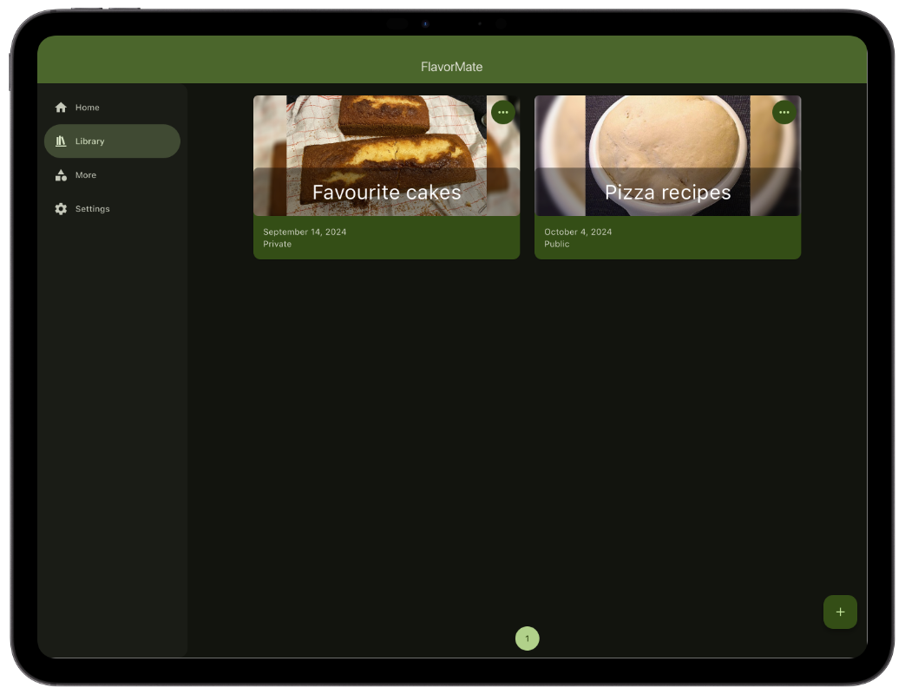

### Recipe editor

Easily create or edit your recipes.

- Create a recipe from scratch or scrape a recipe from a website
- Add nutritional information or use [Open Food Facts](https://world.openfoodfacts.org)[^1]
- Multiple drafts can be created
- Drafts are autosaved

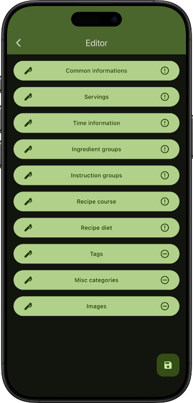
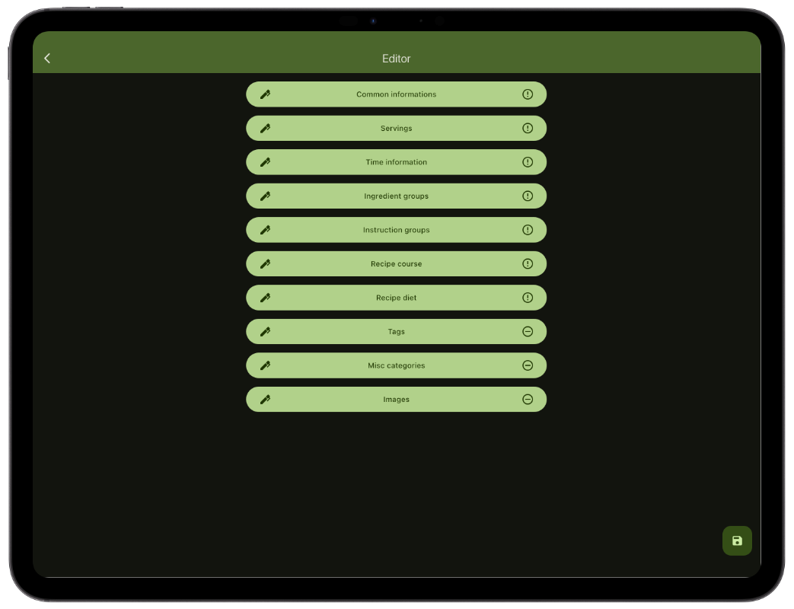

### Diet preference

Choose your diet preference and get your preferred recipes.
You can choose between `meat`, `fish`, `vegetarian` and `vegan`.

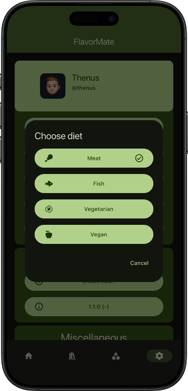
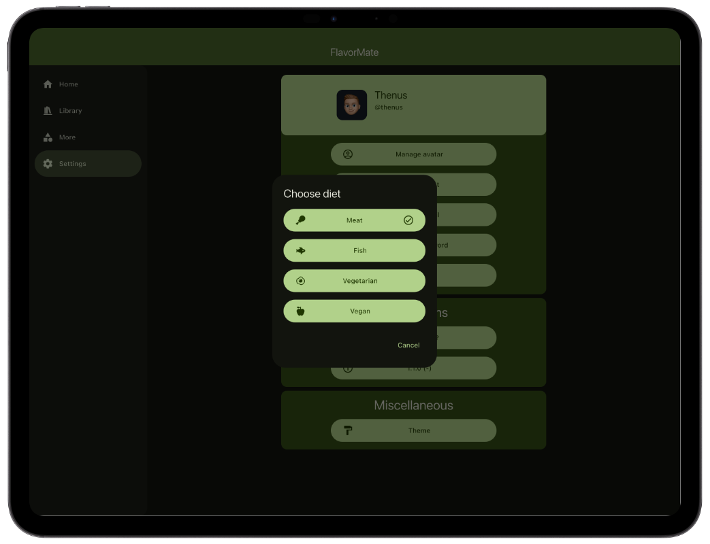

### Theme

Adapt the app to your liking by choosing your favorite color.

- Choose a color you like
- Let the app use your device color (Android, macOS and Windows)

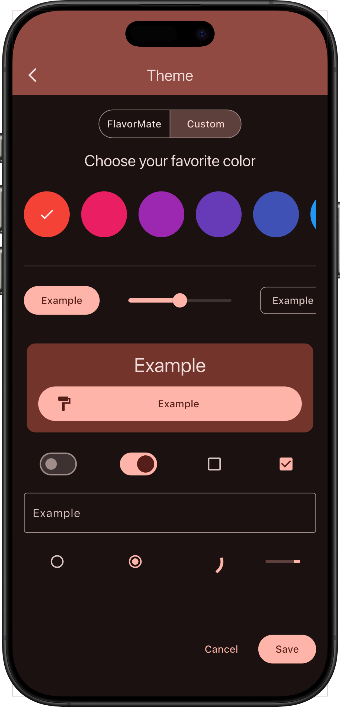
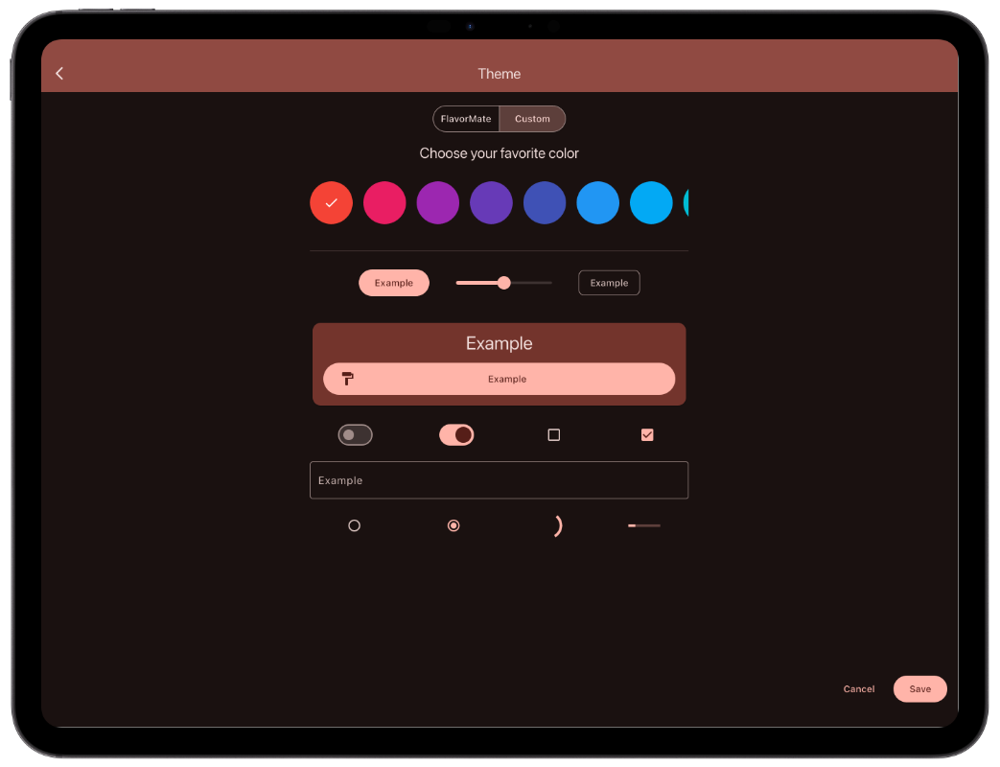

---

[^1]: Feature must be enabled on the server

## Getting Started

Android

The FlavorMate App is currently available as closed beta.

You can enter the beta program by joining [this Google Group](https://groups.google.com/g/flavormate) and

- [Apply on Android](https://play.google.com/store/apps/details?id=de.flavormate) 
- [Apply on the Web](https://play.google.com/apps/testing/de.flavormate)

---

You can also download the `.apk` file from the [releases](https://github.com/FlavorMate/flavormate-app/releases) page.

 

iOS

FlavorMate is available on the [Apple App Store](https://apps.apple.com/us/app/flavormate/id6670196195).

If you want to join the public beta, you can join it via [TestFlight here](https://testflight.apple.com/join/yp5BtJGx).

 

Web

You can self-host your FlavorMate web app with docker.
Download a `docker-compose.yaml` and `.env` file from
the [example page](https://github.com/FlavorMate/flavormate-app/tree/main/examples)  - or -  create one yourself
with the
`ghcr.io/flavormate/flavormate-webapp:2`
image.

If you don't want to use docker you can download the web archive from
the [releases](https://github.com/FlavorMate/flavormate-app/releases) page and host it with a web server.

#### Environment Variables

> [!TIP]
> To permanently bind your frontend to your backend url, add the `BACKEND_URL` entry to your docker environment. 
> The user will then no longer be able to connect to other FlavorMate servers. 
> This improves the user experience and increases security.

| Key         | Required | Description                        | Example               | Default |
|-------------|----------|------------------------------------|-----------------------|---------|
| BACKEND_URL | No       | The url of your FlavorMate backend | `https://example.com` | `null`  |

## Build Project

Follow these steps to build the app locally:

1. Install and configure Flutter SDK
2. Run `flutter pub get` to fetch all dependencies
3. Run `dart run build_runner build` to generate necessary code
4. Run `flutter run` to run the app
